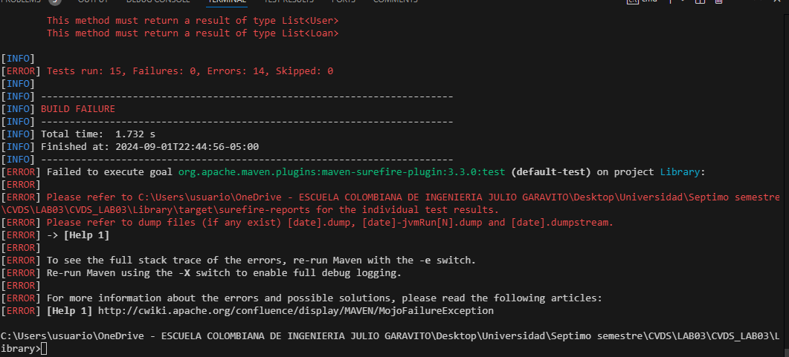
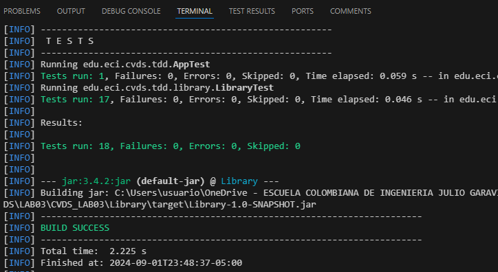
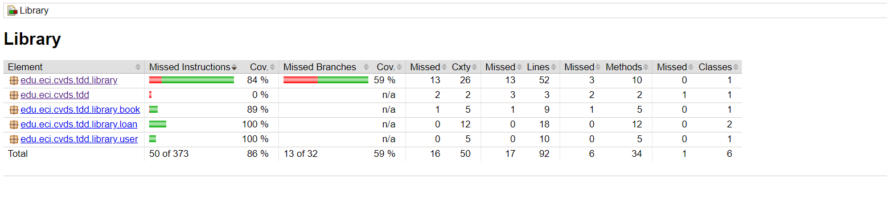
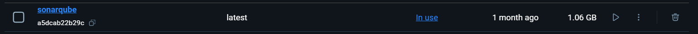
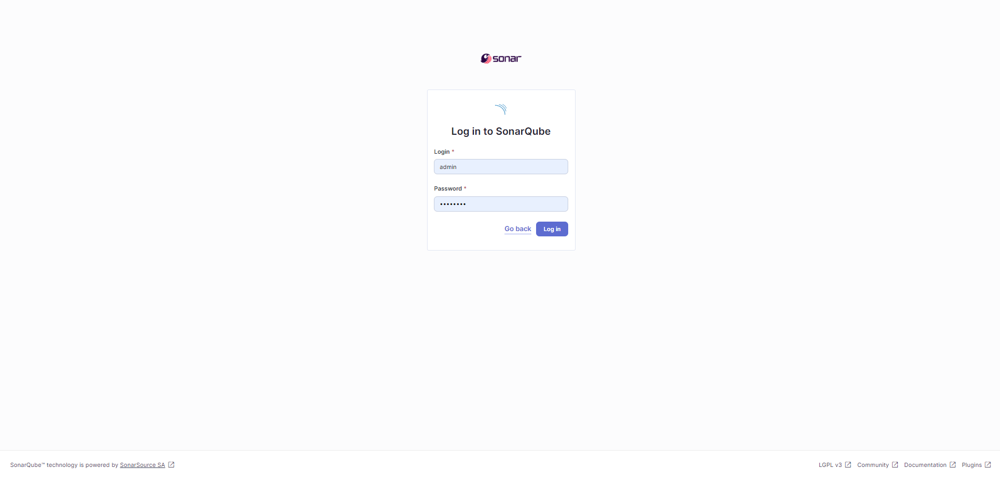
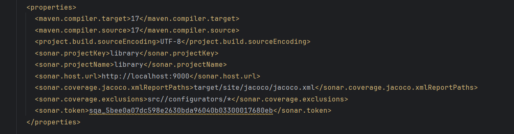
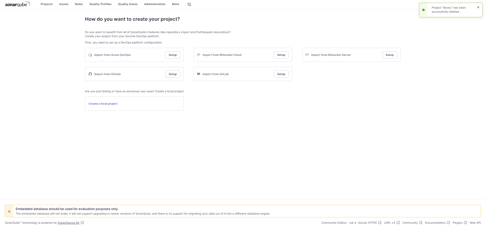
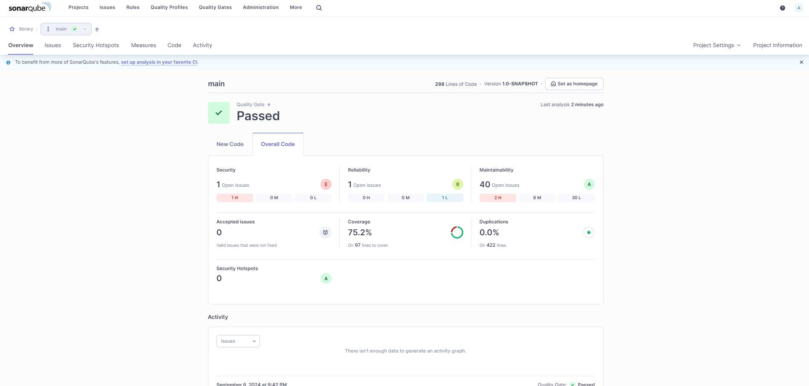

# Laboratorio 3

# Integrantes

## Sebastian Cardona
## Diego Alexander

Este es el laboratorio 3 de la asignatura CVDS. En este laboratorio, los estudiantes Sebastian Cardona Parra y Diego Alexander trabajaron juntos para implementar y probar casos de prueba en una libreria.

## Implementación

Hasta el momento, se han creado los casos de prueba para el código de la clase Library, pero aún no se ha implementado la funcionalidad completa. Durante las pruebas, se ha identificado que el código actual presenta fallos.



Continuaremos trabajando en la implementación y solución de los errores encontrados.


### Una vez hecha la implementación del código

Ya realizamos la implementacion de los métodos de la clase Library, una vez compilado de nuevo el codigo, los testeos pasaron sin problema



### Luego vamos a implemantar Jacoco 

Relizamos la instaalcion en el pom.xml para que se integre como plugin y hacemos unas pequeñas correciones, despues lo que se hace es ejecutar mvn package y luego mvn test, despues ejecutamos el codigo mvn jacoco:resport y esto nos dara una carpeta llamada site en target y la agrimos y nos da los siguientes datos



Como se puede apreciar en la imagen la cobertura de los testeos respecto a todas la clases que tenemos esta por encima de un 80% lo cual es lo solicitado en el respectivo laboratorio

Como se puede apreciar en la imagen anterior, el unico metodo que no tiene testeos es la Clase App.java la cual no se el implementa ningun metodo por el momento

### Ahora vamos a configurar a SONARQUBE

Principalmente lo agregamos en el pom.xml

Y creamos el contenedor con el siguiente comando

Para crearlo
```
docker pull sonarqube
```
Y luego el comando para arrancahrlo en esa dirrecion
```
docker run -d --name sonarqube -e SONAR_ES_BOOTSTRAP_CHECKS_DISABLE=true -p 9000:9000 sonarqube:latest
```

y despues lo que hacemos es visualizar si esta correcto 



Luego ingresamos a la url

```
http://localhost:9000/
```

y este nos dirige a la siguinete pagina 



luego inicamos la session con admin y la contraseña la cambiamos

Configurammos la configuracion de pom.xml con las tokens



Ahora Nos da esta pagina



Y ahora ponemos el comando 
    
```
mvn sonar:sonar
```

Como vemos tenemos una cobertura del 75.2% en los test



Ahora lo siguiente es ver en donde no cubrimos los test y ejecutar nuevamente los test para ver si se soluciono el problema

